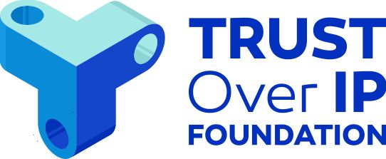

# Join Us

As of our formal launch on 5 May 2020, the Trust over IP Foundation has 29 Founding
Members—17 Steering Member and 12 Contributor Member organizations. Please visit
our website at ​ [https://trustoverip.org/](https://trustoverip.org/​) to see the full membership list. New members are welcome at any time — whether the Steering or Associate paid levels, or at the Contributor level at no cost.  
*It is very important that there be no barrier of entry to any individual or organization who wishes to contribute to the development of the ToIP stack.*  
Please contact us if you have any questions.  
Together we look forward to building the trust layer for the Internet.

© 2020 Trust over IP Foundation. This work is licensed under [Creative Commons Attribution-ShareAlike 4.0 International License](http://creativecommons.org/licenses/by-sa/4.0/).