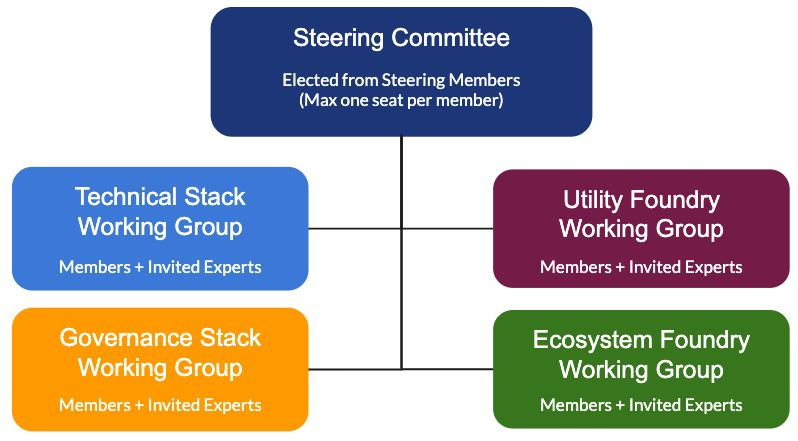

Like almost all Linux Foundation projects, the Trust over IP Foundation is governed by a
Steering Committee composed of representatives of the Steering Members. Steering
Membership is available at two levels: >100 employees (USD $20K/yr), and <100
employees ($5K/yr). Associate Membership is also available at half that cost, and
Contributor Membership are available to both individuals and organizations at no cost.

The work of the Foundation will proceed in four initial Working Groups:
1. The​ **Technical Stack Working Group​** will define the specifications and
interoperability testing requirements for the ToIP Technology Stack.
2. The​ **Governance Stack Working Group**​ will define the models, templates,
guidelines, and recommended best practices for the ToIP Governance Stack.
3. The **Utility Foundry Working Group**​ is a community of practice for governance
authorities implementing ToIP Layer One public utilities—whether as LF projects
or as external governance organizations in any jurisdiction.
4. The **Ecosystem Foundry Working Group**​ is a community of practice for
governance authorities seeking guidance and support in implementing ToIP
Layer Four digital trust ecosystems.