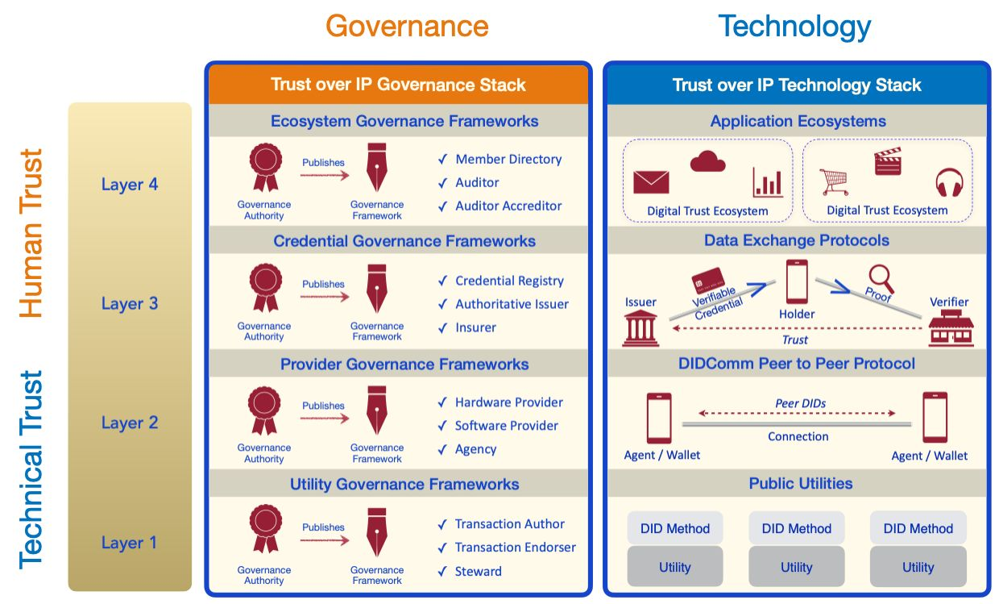

# The Dual Stack Design

As developer communities began implementing DIDs and verifiable credentials, they
recognized this new peer-to-peer trust model could underpin an entire layer of
Internet-scale digital trust infrastructure. As is usually the case, their initial efforts
focused primarily on proving out the technology side of the stack. But as these technical
solutions started bearing fruit, customers began coming to the table looking for
real-world solutions. That’s when attention turned to the “other half” of the stack—the
practical governance and policy questions that must be answered in order to drive
business, legal, and social acceptance. The result is the ​ **dual stack**​ shown below.

Whereas early versions of the ToIP stack reflected its historical origins—technology on
the left followed by governance on the right—real-world experience soon taught us to
reverse it. ​ *Governance first* . In other words, implementing ToIP-based solutions should
begin with​ **business requirements**​, then move to ​ **policy requirements**​ transparently communicated in governance frameworks. Only then should you choose the technology components required to implement those policies.