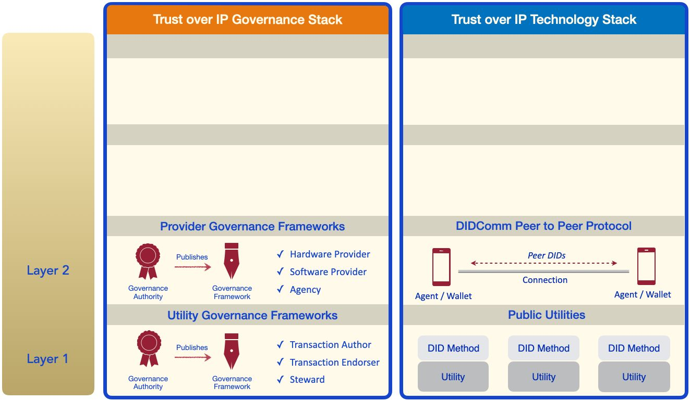

If Layer One is about the strong cryptographic​ *roots* ​ of technical trust, then Layer Two is about the ​*branches* — the digital wallets and digital agents needed to form secure,
private peer-to-peer connections using either public DIDs (from Layer One) or​ [peer
DIDs​](https://openssi.github.io/peer-did-method-spec/index.html). The latter are exchanged directly between the peers and never need to touch a blockchain — a significant advantage for both scalability and privacy.  
Just as the Internet Protocol (IP) forms the [narrow waist]​(https://www.systemsapproach.org/blog/http-is-the-new-narrow-waist) of the TCP/IP stack that
powers the Internet, the DIDComm protocol (currently a Working Group at the
[Decentralized Identity Foundation]​(https://identity.foundation/)) forms the narrow waist of the ToIP stack.

Again, although technical trust is machine-to-machine, how digital wallets and agents
are actually implemented makes a tremendous difference not only to the security and
privacy of users, but to their confidence that their personal data and credentials are truly
portable and vendor-independent (unlike the proprietary digital wallets built into our
smartphones today). This is the province of **provider governance frameworks​** that
can specify the privacy, security, and data protection standards against which hardware
providers, software providers, and cloud hosting providers can be certified.