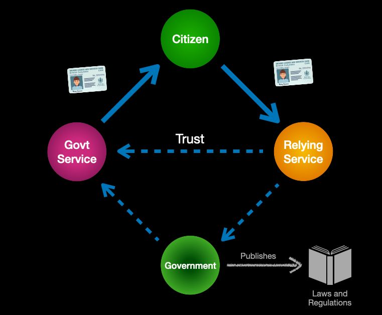
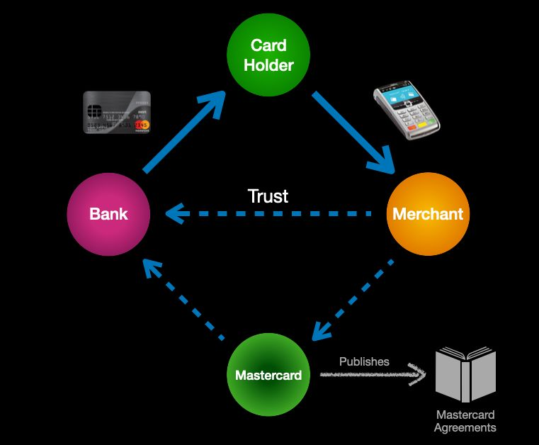

The best-known example of governance trust triangles are credentials issued by
national governments following their own laws and regulations. Many (but not all)
countries issue national citizen ID cards, and almost every country in the world issues
passports under the ​ [ISO/IEC 7810](https://en.wikipedia.org/wiki/ISO/IEC_7810) ID-3 standard.

In these governance trust triangles, the government itself is the governance authority,
the laws and regulations of the country are the governance framework, and the issuers
are the various government services authorized to issue a specific type of credential.
Citizens or businesses can obtain the credentials for which they are qualified and then
present them to any relying service that trusts the government for the accuracy of the
information on the credential.

# Example: Payment Card Networks

Another widely-known example of the governance trust triangle is a payment card
network like Mastercard. In this case, the governance authority is Mastercard; the
issuers are the banks and credit unions in the Mastercard network; the holders are the
individuals or businesses that apply for Mastercards; and the verifiers are merchants
enrolled in the Mastercard network to accept payment cards as shown below.

Although government-issued IDs and credit cards are the most common examples of
credentials we carry in our own wallets, there are hundreds of other examples of
governance trust triangles all around us: health insurance cards, student ID cards,
employment ID cards, membership cards, loyalty cards, etc. In every case, the value of
the credential depends on the trust the verifier has in the governance authority.