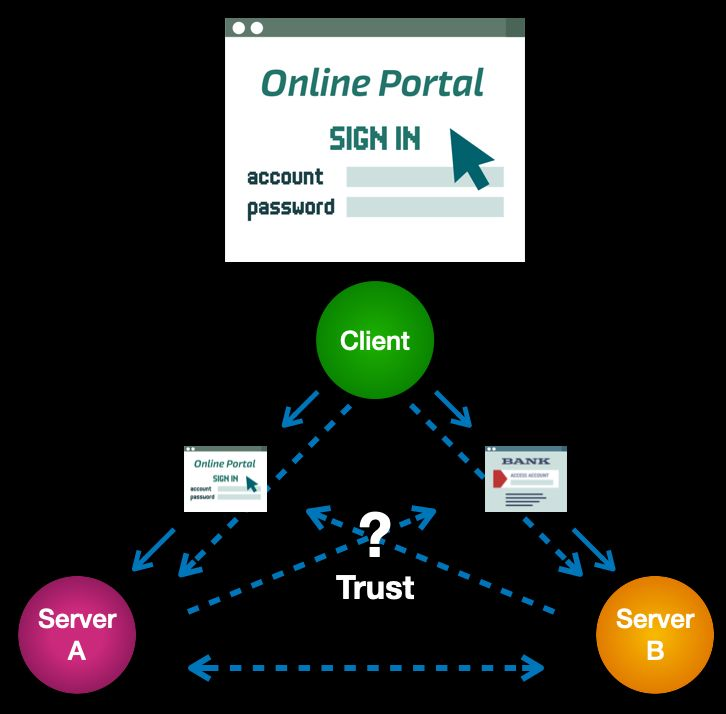

Faced with this escalating problem, technologists unwittingly drove the next wedge into
the trust gap by trying to swing the server hammer even harder. They created the
“federated login”, where you could reuse the account you had with one server to login to
another server. This gave rise to the “single sign-on portal” that is now ubiquitous on
most intranets. The mass-market equivalent is social login buttons — from Facebook,
Google, LinkedIn, Twitter, etc. — that you see on many consumer-facing websites.

Federated login protocols like SAML and OpenID Connect do relieve some of the pain
of maintaining long lists of usernames and passwords and repeatedly logging into sites
and services. So they have achieved some measure of adoption. However there is a
simple structural reason that they have not solved the ever-widening trust gap.