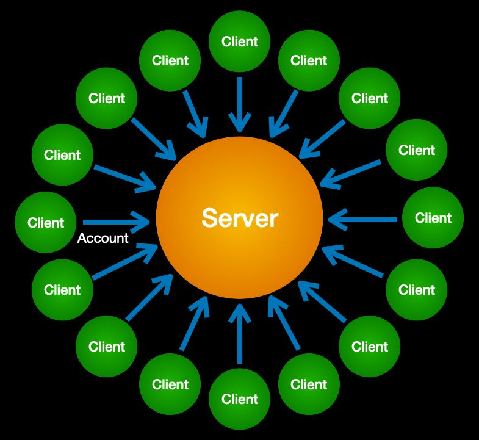

Since the first computers were still the size of refrigerators, access to the “login”
terminals worked like everything else in the real world: a door with a guard who would
let you in after verifying the credentials you carry in your wallet. But as soon as we
moved into a networked world,​ *login access could no longer be controlled via physical
security*. So we created​ **computer-based access controls**​ to the login account. This
was the birth of the dreaded username and password.  
Because the login account was the virtual “door” to a server — and the server the
gateway to a network — we tried to control everything by virtue of login accounts. The
supremacy of servers in this “client-servitude” model is shown below.  

“If the only tool you have is a hammer, everything begins to look like a nail.” Login
accounts became the accidental actor in the middle of all our online interactions. No
network task requiring trust could be performed without one or more logins. Pretty soon
we had hundreds of usernames and passwords, and the trust gap widened even further.